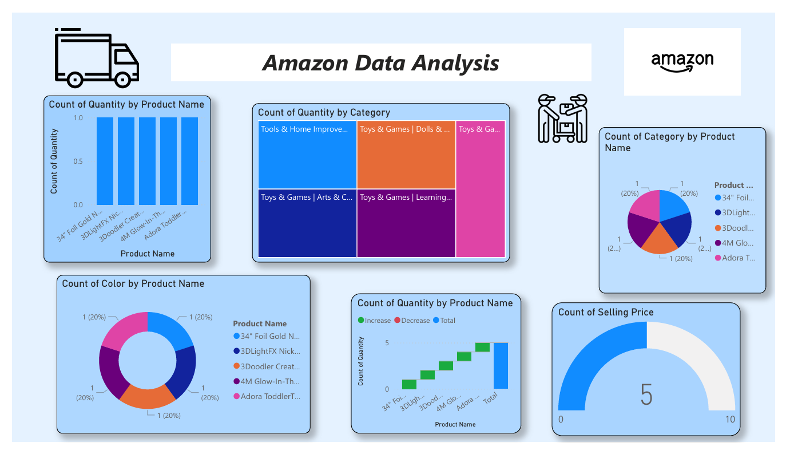
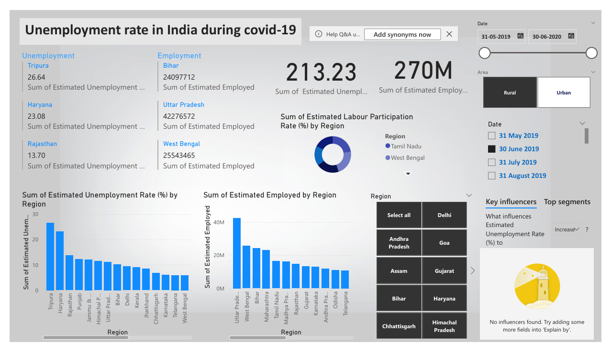
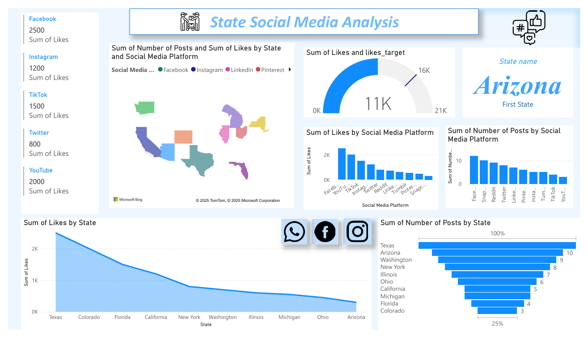
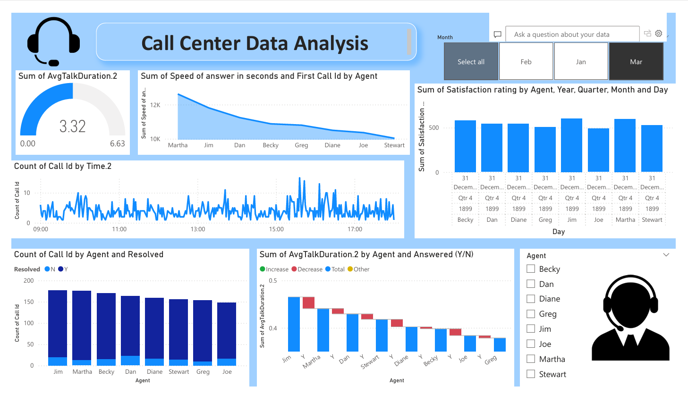

# PowerBI
Power BI reports and dashboards I designed to turn raw data into meaningful insights.

# 📊 Power BI Dashboard Visualizations

Welcome to the **Power BI Dashboard Gallery**!  
This repository showcases a collection of interactive and insightful dashboards created using **Microsoft Power BI**. These visualizations aim to derive meaningful insights from different datasets across domains such as e-commerce, employment, social media, and customer service.

---

## 🗂️ Dashboards Included

### 1. Amazon Product Data Analysis
Analyzes product distribution, category segmentation, and pricing using Amazon product data.

---

### 2. Unemployment Rate in India During COVID-19
Highlights unemployment rates across Indian states and compares employment statistics during the COVID-19 timeline.

---

### 3. State-wise Social Media Analysis
Tracks engagement metrics like likes and post counts across different platforms and states in the US.

---

### 4. Call Center Performance Dashboard
Monitors agent-wise call performance metrics including talk time, satisfaction, and resolution rates.

---

## 🛠️ Tools Used

- Power BI
- DAX for calculated measures
- Data transformation using Power Query
- Custom visuals for enhanced interactivity

---

## 📌 Purpose

This repository serves as a portfolio to demonstrate proficiency in data visualization, storytelling with data, and dashboard design using Power BI. Each report focuses on clean UI, relevant KPIs, and actionable insights.

---

